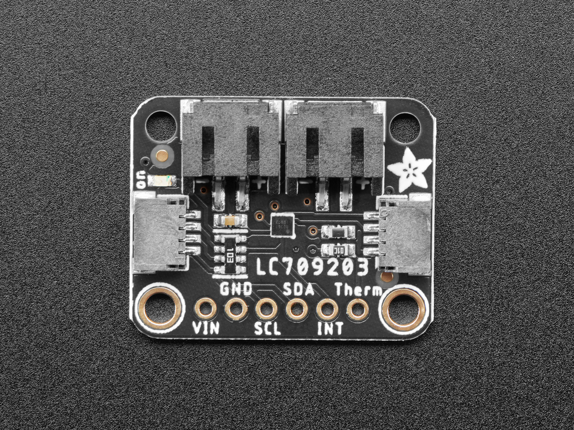
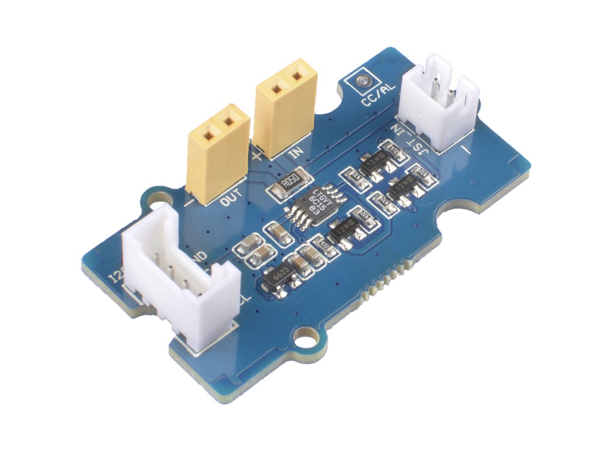
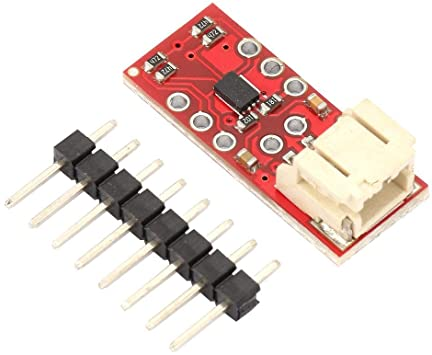
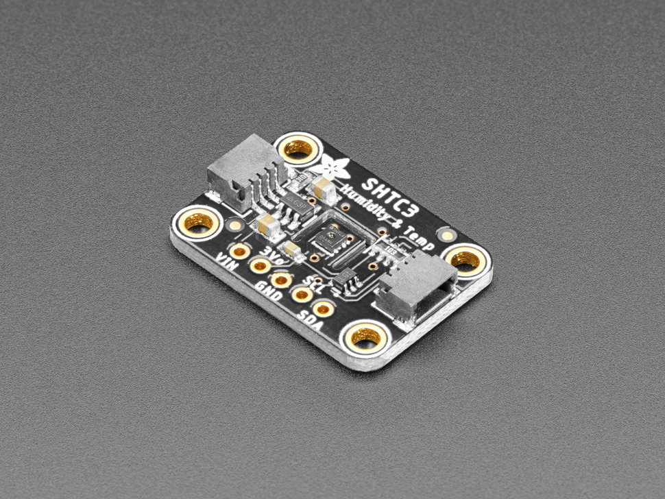
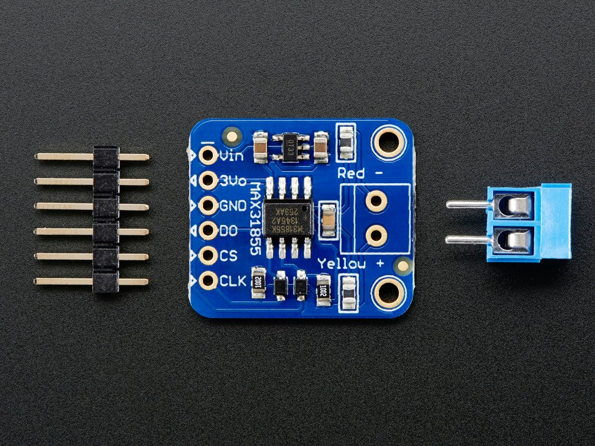

# BFG Research

## HIL Branch Configuration

### Overview

This branch is specifically set up for Pradeep Kumar's HIL Temperature Project.

This project uses the following devices:

    INA260
    LC709203F
    MAX31855

This configuration does **NOT** use the TCA9548A multiplexer. There are no address conflicts between the devices, and the TCA9548A is not necessary. That said, both I2C devices (INA260 and LC709203F) will be connected to the same I2C bus in parallel.

### Running the Program

Once `arduino.ino` has been programmed to the Arduino, connect over USB. In `src/Devices.py`, on Line 8, set the serial port to whichever port the Arduino is on.

Request frequency is set using the Hz variable set at the top of `src/main.py`.

Run `src/main.py` with python3, and the program will run, collecting data from the devices.

Collected data, as well as a log, is stored in `data/`, in .csv and .txt files.

## Summary

This repository is for development of data collection programs for a Raspberry Pi Zero, testing and comparing different Battery Fuel Gauges.

**To install dependencies, please run:** `pip install -r src/requirements.txt`

**To run the program, please run:** `python src/main.py`

The [arduino-cli](https://siytek.com/arduino-cli-raspberry-pi/) project is used for compiling and uploading the Arduino code on a command line, using the Makefile. Do steps up to and including *Adding to $PATH*, and then use `make libraries` in the `arduino` folder to install the avr binary and the arduino libraries.

## Devices Interfaced

| Device                                                    | Product Page                                                                                       | Datasheet                                                                    | Arduino Library                                                                                                                                                  | Manufacture    | Description                                                                                     |
| --------------------------------------------------------- | -------------------------------------------------------------------------------------------------- | ---------------------------------------------------------------------------- | ---------------------------------------------------------------------------------------------------------------------------------------------------------------- | -------------- | ----------------------------------------------------------------------------------------------- |
|             | [LC709203F](https://www.adafruit.com/product/4712)                                                 | [Short Guide](datasheets/adafruit-lc709203f-lipo-lipoly-battery-monitor.pdf) | [Adafruit_LC709203F](https://github.com/adafruit/Adafruit_LC709203F)                                                                                             | AdaFruit       | BFG, reads a combination of voltage and current, to estimate the battery's charge and capacity. |
|             | [LTC2941](https://www.analog.com/en/products/ltc2941.html#product-overview)                        | [Datasheet](datasheets/LTC2941.pdf)                                          | [Seeed_LTC2941](https://github.com/Seeed-Studio/Seeed_LTC2941)                                                                                                   | Analog Devices | BFG, Measures mAh drawn from a LiPo battery.                                                    |
|             | [MAX17043](https://www.maximintegrated.com/en/products/power/battery-management/MAX17043.html)     | [Datasheet](datasheets/MAX17043-MAX17044.pdf)                                | [SparkFun library](https://github.com/sparkfun/SparkFun_MAX1704x_Fuel_Gauge_Arduino_Library)                                                                     | Analog Devices | BFG, Measures mV across battery cell for estimate.                                              |
|   | [TCA9548A](https://learn.adafruit.com/adafruit-tca9548a-1-to-8-i2c-multiplexer-breakout/downloads) | [Datasheet](datasheets/tca9548a.pdf)                                         | [GitHub](https://github.com/WifWaf/TCA9548A)                                                                                                                     | AdaFruit       | An I2C multiplexer, for connecting all devices to the arduino I2C bus.                          |
|      | [SHTC3](https://learn.adafruit.com/adafruit-sensirion-shtc3-temperature-humidity-sensor/arduino)   | [Datasheet](datasheets/SHTC3.pdf)                                            | [GitHub library](https://github.com/adafruit/Adafruit_SHTC3)                                                                                                     | AdaFruit       | Adafruit Sensirion SHTC3 Temperature & Humidity Sensor                                          |
|  | [MAX31855](https://www.adafruit.com/product/269)                                                   | [Datasheet](datasheets/MAX31855.pdf)                                         | [Arduino Guide](https://learn.adafruit.com/thermocouple/arduino-code#arduino-library-2958404-6), [GitHub](https://github.com/adafruit/Adafruit-MAX31855-library) | AdaFruit       | Thermocouple Amplifier MAX31855 breakout board, USES SOFTSERIAL. Uses pins 4,5,6                |
|    | [INA260](https://learn.adafruit.com/adafruit-ina260-current-voltage-power-sensor-breakout)         | [Datasheet](datasheets/ina260.pdf)                                           | [GitHub library](https://github.com/adafruit/Adafruit_INA260)                                                                                                    | AdaFruit       | Adafruit INA260 Current + Voltage + Power Sensor                                                |
|  | [INA219](https://learn.adafruit.com/adafruit-ina219-current-sensor-breakout)                       | [Datasheet](datasheets/ina219.pdf)                                           | [GitHub library](https://github.com/adafruit/Adafruit_INA219)                                                                                                    | AdaFruit       | Adafruit INA219 Current Sensor                                                                  |

## Implementation

Since two of the units are designed for Arduino, the simplest way to implement this is to use an Arduino, and get all data from the arduino, onto the pi, over serial.

The pi sends JSON payloads to the arduino, which unpacks them, grabs the necessary data from the device requested, repacks it, and sends it back to the pi.

**The Python code for Pi is under `src`; the arduino code is under `arduino`**

## The Pi

The raspberry pi will be used for data collection, from the raspberry pi. The serial interface between the pi and the arduino will send requests back and forth. The easiest way to do this is with string requests.

## The Arduino

The arduino will interface with all hardware devices over I2C. Whenever a request comes in for an update on a device from the Pi, the Arduino will read data on the appropriate I2C interface, and return the data as JSON payload.

### Requirements

- Data will be communicated over serial, in JSON format. Arduino library is [ArduinoJSON](https://github.com/bblanchon/ArduinoJson).
- Manage the I2C bus, using a multiplexer, to get data from the correct devices
- All required key responses will be defined in a generic class, which will be a superclass to the BFG devices. This will allow for mosular queries.
- The BFGs will be kept in a map, where keys are the device string names, and the values are the BFG objects. Each data key will be associated with a BFG function call, so the JSON string queries can be directly mapped to the BFG functions.

### Table of Keys

| Key | Description                       |
| --- | --------------------------------- |
| D   | specifies the device being queued |
| V   | Battery Voltage (V)               |
| I   | Battery Current (mA)              |
| W   | Battery Wattage (mW)              |
| C   | Battery Capacity (mAh)            |
| P   | Battery Percentage (0-100)        |
| T   | Battery Temperature (C)           |
| H   | Ambient Humidity (Relative, %)    |

### Table of Devices and Callable Attributes

| Device    | Update String | Description                                      |
| --------- | ------------- | ------------------------------------------------ |
| SHTC3     | TH            | Temp, Humidity                                   |
| INA219    | I             | Current sensor across shunt                      |
| MAX31855  | TC            | T thermocouple, C internal temp                  |
| MAX17043  | VP            | Voltage, Percentage on BFG                       |
| LC709203F | VPT           | Voltage, Percentage on BFG, Temp on thermocouple |
| INA260    | VIW           | Voltage, Current, Power                          |

*It should be noted that the MAX31855 can call T() for thermocouple reading, or C() for internal temp reading. C() usually returns capacity in mAh.

<!-- | S                   | ?                                 | Battery State (0=discharging, 1=charging) | int   | -->

## Device Communication

| Device    | Address |
| :-------- | :------ |
| TCA9548A  | 0x70    |
| LC709203F | 0x0B    |
| SHTC3     | 0x70    |
| MAX31855  | SPI     |
| MAX17043  | 0x36    |
| INA219    | 0x40    |
| LTC2941   | 0x64    |
| INA260    | 0x40    |

*NOTE:* The TCA9548 Multiplexer address needs to be changed to 0x71. This is done by pulling pin A0 HIGH.

### Request JSON (Pi -> Arduino)

JSON requests will be one key/value pair. The key will be the device being queried, and the value will be an array of strings associated with values requested.

### Response JSON (Arduino -> Pi)

Output JSON will be will be a dict of dictionary of key/value pairs. Each root query key is the device, to identify the device being echoed. The value data being sent will be the key/value pairs for queried data, for each key/device.

### LOGGING/MESSAGE PACKETS

Payloads sent from the Arduino to the Pi can be marked as 'logging messages', which will be displayed to the terminal. This is useful for debugging, and for getting a sense of what is going on.

Messages are JSON payloads formatted as: `{"D":"LOG","M":"<msg>"}`.

Messages can be sent on the Arduino by calling the `LOG(String msg)` function.
